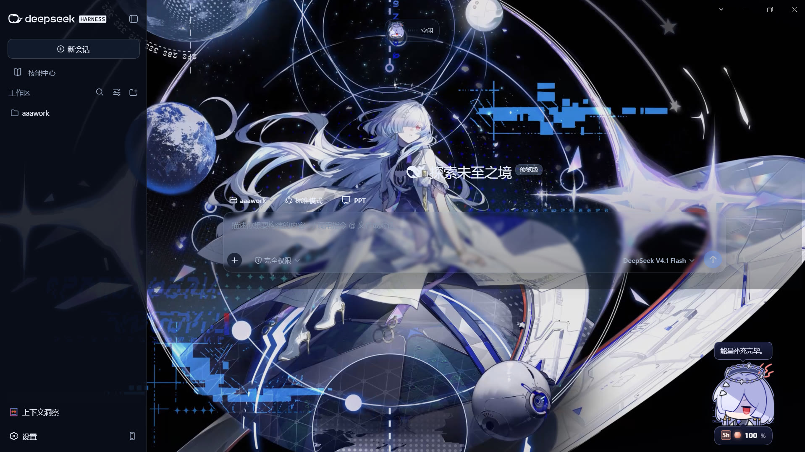

# dsh-mornye-theme

莫宁（Mornye）主题皮肤 —— 给 DSH Desktop 换上一整套「莫宁」外观：**全屏动态壁纸 + 屏幕上会跟着你的小桌宠 + 冷色调界面**。

装好后，你的 DSH Desktop 会变成这样：整屏在动的角色壁纸、右下角站着一个可以拖来拖去的莫宁小人、界面统一成深色配冷蓝的配色。外观那一栏里会多出一个「莫宁」，随时能切回原样，不影响别的东西。



> **不想装 git？** 直接下打包好的 zip：[**Releases → v0.1.1**](https://github.com/eraerkni/dsh-mornye-theme/releases/latest)
> （解压出来就是 `dsh-mornye-theme/` 目录，照下面「安装」的第 2~4 步注册即可）

## 能做什么

- **整屏动态壁纸**：拿一段 mp4 当整个界面的背景，一直播。默认铺满整屏，也能切成「留边」。
  做法上它启动得比普通插件更早，所以打开软件第一眼就是莫宁，不会先闪一下默认的界面。
- **屏幕上的小桌宠**：可以用鼠标拖着换地方，位置记在本地、下次打开还在原处；点一下它会弹一下。
  - **说话**：它会每隔 30 秒说一句话，话是从一个纯文本文件里读的（一行一句，你自己写）。
  - **两种余额，右键切换**：能显示 **DeepSeek 官网余额**（具体金额），也能显示 **OpenCode Go 订阅额度**（剩余百分比）。
    **在桌宠上点右键**会弹出一个小面板：上面选显示哪种，下面用滑杆调小人的大小（70%~160%），选择过的大小和模式都会记住。
  - **官网余额（默认）**：显示金额和币种，左键点一下＝刷新。
  - **订阅额度**：显示 5 小时内还能用多少，**左键点一下在三个档位之间轮换**：5 小时 → 本周 → 本月 → 回到 5 小时。
    鼠标悬停在上面能看到什么时候重置（北京时间）。
  - **峰谷小方块**：工作日 9:00–12:00 和 14:00–18:00（北京时间）显示橙色「峰」，其余时间是蓝色「谷」。
- **回复旁边的角色头像**：AI 每回复一段，左边就会出现一个莫宁的圆形小头像。
- **整机冷色调**：深色底 + 冷蓝色调，输入框、弹窗、面板都是半透明磨砂效果（能透出后面的壁纸）。
- **外观栏多一个选项**：在「外观」那一栏里多出「莫宁」这一块（和浅色 / 深色 / 跟随系统并列），随时切换。
- **AI 也用莫宁的口吻干活**（可选）：插件自带一份「莫宁人格」，装好后新建会话时选它，AI 就按她的方式说话与汇报 —— 见下面「莫宁人格」一节。
- **开屏动画**（可选，改的是软件安装目录，不算插件本体）：见下面「开屏画面」一节。

## 安装

### 先决条件

- 一份已安装并可正常启动的 **DSH Desktop**。
- **git（或直接下载 zip 也行）** —— 只有从源码装才需要。
- **不需要 Node.js / pnpm**：本插件的 `node_modules` 是**空依赖**，宿主自带 pnpm 只是为了重链接。
- 磁盘：插件本体约 **21MB**（其中壁纸视频 ~20MB）。

### 三种拿文件的方式

**A. git clone（推荐，方便以后 `git pull` 更新）**

```powershell
$plugins = "$env:APPDATA\dsh-desktop\harness\profiles\web\local-plugins"
git clone https://github.com/eraerkni/dsh-mornye-theme.git "$plugins\dsh-mornye-theme"
```

**B. 下载 Release 的 zip（不用装 git）**

从 [Releases](https://github.com/eraerkni/dsh-mornye-theme/releases/latest) 下载 `dsh-mornye-theme-v0.1.1.zip`
（约 20MB），解压到：

```
%APPDATA%\dsh-desktop\harness\profiles\web\local-plugins\
```

> ✅ Release 的 zip 已经打包成 `dsh-mornye-theme/` 顶层目录，**解压后直接就是正确目录名，不需要重命名**。

**C. 下载源码 zip（仓库页 → Code ▾ → Download ZIP）**

> ⚠️ 源码 zip 解压出来的目录名会带 `-main` 后缀，**记得重命名成 `dsh-mornye-theme`**，
> 否则和下面的注册名对不上。它和 Release zip 内容基本一致，只是目录名需要自己改。

### 注册进 profile（关键一步，缺一不可）

文件放好后，要让 profile 认识它。**目录名 `dsh-mornye-theme` = 注册名**，三处必须一致：

```powershell
$web = "$env:APPDATA\dsh-desktop\harness\profiles\web"

# ① profile 依赖里加一条（指向你刚放的目录）
#    编辑 $web\package.json，在 "dependencies" 里加：
#      "dsh-mornye-theme": "file:local-plugins/dsh-mornye-theme"

# ② 让它真正出现在 bundles 里（编辑同一个文件）
#    "dsh": { "profile": { "bundles": [ ..., "dsh-mornye-theme" ] } }

# ③ 建 junction（不要直接复制文件进去，否则改了源码不生效）
New-Item -ItemType Junction `
  -Path   "$web\node_modules\dsh-mornye-theme" `
  -Target "$web\local-plugins\dsh-mornye-theme"
```

然后**重启 DSH Desktop**。之后改 `client/client.js` 只需刷新页面（F5）。

自检：设置 → 通用设置 →「外观」那一栏出现 **莫宁** 方块；右下角出现挂件；壁纸铺满。

> **命名说明**：插件的内部 id 是 `mornye-theme`（见 `cordis.patch.yml` 与 `lib/index.js` 的 `name`），
> 所以接口前缀是 `/plugins/mornye-theme/…`。仓库名叫 `dsh-mornye-theme`、你也用这个目录名注册，两者不冲突 ——
> **关键是目录名、依赖声明、bundles 条目三者一致**。你要是更喜欢 `mornye-theme` 这个目录名，三处都写成它也一样能用。

### 卸载

删掉 junction、从 `package.json` 里移除依赖与 bundles 条目、再删插件目录，然后重启。

> 人格是独立的一份 preset，卸载皮肤**不会**动它。不要了就删掉 `$DSH_HOME\.agent-presets\mornye\`。

## 莫宁人格（让 AI 也用她的口吻干活）

皮肤管的是「看起来像莫宁」，这一节管的是「说话像莫宁」。

插件随包带了一份**莫宁人格预设**，启动时会把它铺设到你的 DSH 里（目录已存在就跳过，不覆盖你改过的）：

```
$DSH_HOME\.agent-presets\mornye\      # DSH_HOME 默认 %APPDATA%\dsh-desktop\harness
  agent.cordis.yml    人格正文 + 完整工具链
  preset.yml          选择器里显示的名字与描述
```

**怎么用**：重启 DSH Desktop 后**新建一个会话**，在新建会话的 preset 选择处选「莫宁」。
之后这个会话里 AI 就用她的方式说话：句子短、先给结论、用工程语言（开工「列阵」、做完「推演完成」），
对无关的客套冷淡、只对你有例外，而且那份热情表现得很省。

**几件要知道的事**：

- **只影响新建的会话**。已经开着的会话不会变；preset 在会话创建时就固定了，中途换不了（这是前缀缓存复用的要求）。
- **它是一份 agent preset，不是外观**。只要你想要人格、不想要皮肤：把 `preset/` 里那两个文件复制到
  `$DSH_HOME\.agent-presets\mornye\` 就行。
- **会多用一点 token**：人格正文约 1160 字（≈650 token/请求），随会话固定注入、可被缓存复用。
  子代理会继承父会话的 preset，所以一次派多个子代理时每个都带一份。
- **不想让它自动装**：设 `DSH_MORNYE_SKIP_PRESET=1`；已经装过又改过、怕被覆盖：目录存在时插件**一律跳过**，
  真要强制覆盖才用 `DSH_MORNYE_REDEPLOY_PRESET=1`。
- **想自己改**：直接改 `agent.cordis.yml` 里的 `text`，改完**新建会话**才生效。
  ⚠️ 正文里成对的 `{{...}}` 会被当变量严格求值，DSH 只注册了 `provider` / `model` / `cwd` 三个，写错会在首轮报错。
- **右上角的状态挂件也跟着说莫宁的话**：空闲＝「基准模式」、生成中＝「推演中」、收工＝「推演完成」、出错＝「检测到危险」——用词都取自游戏里的语音。
- 排错：`GET /plugins/mornye-theme/preset` 会告诉你人格装没装、铺到了哪个目录。

> 人格正文是从角色的语音语料里提炼的。语料里**零颜文字、零语气词、也不撒娇**——她本来就不这么说话。
> 所以这个模式刻意**不做**卖萌装饰：那会把人演成另一个角色。

## 让 AI Agent 帮你装（不想动手就用这个）

把下面这整段**原样粘贴**给你正在用的 AI 编程助手（Claude Code / Codex / Cursor / DSH 里的 agent 都行），
它能自己完成全部步骤。**前提**：助手能读写你本机的文件、能执行命令。

> ⚠️ **别让 agent 用 GitHub 的「逐个文件」方式取代码**（contents API / 网页点单个文件下载）。
> 那个接口对 **大于 1MB 的文件不返回内容**，而本仓库的壁纸视频有 **约 20MB** —— 会静默漏掉它，
> 装完就是"皮肤在、壁纸是黑的/没视频"。**要么 `git clone`，要么下 Release zip，要么用下面的 raw 直链补文件。**

```text
请帮我在本机安装 DSH Desktop 的「莫宁」主题插件 dsh-mornye-theme，按下面步骤做，做完给我验证结果。

背景（重要，别搞错）：
- 插件分 host / client 两半，插件目录必须放在 profile 的 local-plugins 下，并用 node_modules 里的
  junction 指向它（不要真的把文件复制进 node_modules）。
- 插件的内部 id 是 mornye-theme，但目录名 / 依赖名 / bundles 名三者必须一致，统一用 dsh-mornye-theme。
- 改完必须重启 DSH Desktop 才生效（host 半边只在启动时加载）。
- ⚠️ 取文件请整体取（git clone 或下 zip）。**不要用 GitHub contents API 逐个文件下载**：
  它对 >1MB 的文件不返回内容，会让 20MB 的壁纸视频漏掉。

步骤：
1) 先探测环境，不要写死路径：
   $web = Join-Path $env:APPDATA 'dsh-desktop\harness\profiles\web'
   确认 $web 存在（不存在就停下来问我 DSH Desktop 装在哪）。
2) 取插件（三选一），放到 "$web\local-plugins\dsh-mornye-theme"：
   a. git clone https://github.com/eraerkni/dsh-mornye-theme.git "<临时目录>\dsh-mornye-theme" 后复制过去；
   b. 下载 Release 的 zip（约 21MB）并解压后复制过去：
      https://github.com/eraerkni/dsh-mornye-theme/releases/download/v0.1.0/dsh-mornye-theme-v0.1.0.zip
   c. 若上面两种都不可用，就逐个取文件，但**壁纸视频必须单独下**（它 >1MB，contents API 会给空）：
      Invoke-WebRequest -Uri "https://raw.githubusercontent.com/eraerkni/dsh-mornye-theme/main/assets/wallpaper.mp4" `
        -OutFile "$web\local-plugins\dsh-mornye-theme\assets\wallpaper.mp4"
3) 复制后确认这两个文件都在：
   "$web\local-plugins\dsh-mornye-theme\package.json"
   "$web\local-plugins\dsh-mornye-theme\assets\wallpaper.mp4"   ← 大小应约 20,629,262 字节（≈20MB）
   若视频缺失或明显偏小，回到第 2 步换一种取法重来，别继续往下装。
4) 注册进 profile：只改 "$web\package.json" 这一个文件，两处都要加：
   - dependencies 里加：   "dsh-mornye-theme": "file:local-plugins/dsh-mornye-theme"
   - dsh.profile.bundles 数组里加："dsh-mornye-theme"
   ⚠️ 必须用 JSON 解析后改再写回（例如 node 里 JSON.parse / JSON.stringify）。
      不要用字符串替换或正则改这个文件，会损坏我的配置。改前先备份成 package.json.bak。
5) 建 junction（不是复制）：
   New-Item -ItemType Junction -Path "$web\node_modules\dsh-mornye-theme" -Target "$web\local-plugins\dsh-mornye-theme"
6) 自检并报告：
   - Test-Path "$web\local-plugins\dsh-mornye-theme\package.json"          → 应为 True
   - (Get-Item "$web\node_modules\dsh-mornye-theme" -Force).LinkType       → 应为 Junction
   - "$web\package.json" 仍是合法 JSON，且 bundles 里有 dsh-mornye-theme
   - 壁纸视频： (Get-Item "...\assets\wallpaper.mp4").Length ≈ 20629262
     （想更严格可校验 SHA-256 = 588E78B64119C8791000A50CEEE894C71FBADB478934A1C5CB2E7BC285901930）
   最后告诉我：需不需要重启 DSH Desktop 才能看到效果，以及重启后怎么确认成功
   （设置 → 通用设置 →「外观」一栏出现「莫宁」即成功）。

注意：不要顺手改我 profile 里的其它插件配置，也不要动 DSH 软件安装目录里的文件。
```

> 为什么给的是"让 agent 自己做"而不是一条安装命令：**插件的加载依赖那份 profile 配置**
> （`package.json` 的依赖 + bundles 条目），任何自动改写都有搞坏配置的风险，所以我把约束写清楚让 agent 按规矩做。
> 第 3 步那句「必须 JSON 解析后写回」是关键，请保留。

## 关于桌宠上的余额 / 额度

桌宠下面的小气泡会显示一个数字。**在桌宠上点右键**可以选显示哪种：

- **官网余额**（默认）：DeepSeek 账户里还剩多少钱，左键点一下就是刷新。**需要你自己配一个 DeepSeek 的 API Key**，
  没配的话这里会显示 `--`（其余功能都不受影响）。
- **订阅额度**：如果你用的是 **OpenCode Go** 订阅（$10/月那种），这里显示的是**还能用多少**。
  左键点一下在「5 小时 / 本周 / 本月」三个档位之间轮换 —— 订阅是按这三个时间窗限量的。

Key 放哪：写在环境变量 `DEEPSEEK_API_KEY` / `OPENCODE_GO_API_KEY` 里，或者放在 DSH 自己的凭据文件里
（`%APPDATA%\dsh-desktop\harness\.credentials.yaml`）。**插件不会把 Key 发到别处**，也不会写进任何日志。

<details>
<summary>技术细节：额度数据是怎么来的（想改代码再看）</summary>

上游是 OpenCode Go 的官方接口：

```
GET https://opencode.ai/zen/go/v1/usage
Authorization: Bearer <OPENCODE_GO_API_KEY>      # 注意：换成 x-api-key 会 401
→ {"usage":{"rolling":{"percent":3,"resetsAt":"…"},"weekly":{…},"monthly":{…}}}
```

- 官方**只给「已用百分比」**，没有余额、也没有「今日使用」→ 界面上的「剩余 %」= `100 - percent`。
- **「今日已用」是本插件自己采样算的**：每次取数把百分比记进 `quota-samples.json`，按窗口分桶取 `max - min`
  （额度会随旧请求过期而回落，所以用涨跌幅而不是末值）。上游的 `resetsAt` 每次请求都会毫秒级漂移，
  所以分桶前先量化到 30 分钟，否则每次请求都会开一个新桶。
- 官方额度上限（文档口径）：**$12 / 滚动 5 小时、$30 / 周、$60 / 月**。
- 不用 OpenCode Go 的话：额度接口会返回 502，桌宠显示 `--` 并把气泡标红，**其余功能不受影响**。

</details>

## 素材

仓库带一份压好的壁纸视频，clone 下来就能直接用：

| 素材 | 位置 | 说明 |
|---|---|---|
| `wallpaper.mp4` | **仓库已带**（约 20MB） | 1080×1080 / 30fps / H.264 / 无音轨。原始素材是 2560×2560 60fps（106MB），为了让仓库能塞进 GitHub 做了转码（`-an -vf scale=1080:1080 -r 30 -crf 23 -movflags +faststart`）。**精确大小 20,629,262 字节**，SHA-256 `588E78B6…5901930` |
| `poster.jpg` | 仓库已带（~700KB） | 视频解码前的封面帧，避免首屏黑一下 |
| `pet.png` / `avatar.png` | 仓库已带 | 桌宠图与头像的**源文件**；插件实际用的是内嵌进 `client.js` 的副本（见「开发」） |
| 换成自己的视频 | `assets/wallpaper.mp4` **或** `%APPDATA%\dsh-desktop\mornye-theme\wallpaper.mp4` **或** 环境变量 `DSH_MORNYE_WALLPAPER` | 想换壁纸就把自己的 mp4 放这三个位置之一。建议 16:9、H.264、1080p 以内；4K60 会一直占 GPU 解码 |
| `lines.txt` | `%APPDATA%\dsh-desktop\mornye-theme\lines.txt` **或** `DSH_MORNYE_LINES` | 桌宠台词，一行一句（UTF-8 或 GBK 都认）。仓库里有 `lines.example.txt` 可以照抄 |

> 桌宠 / 头像 / 壁纸这些**角色素材**的版权不属于本项目（见 LICENSE 末尾说明）；如果你想发布自己的分支，
> 建议换成你自己的素材，或把 `assets/` 里对应文件删掉（插件在缺图时会走兜底样式、壁纸会回 404 并提示怎么放视频）。

## 开屏画面（可选，改的是软件安装目录）

装好后打开 DSH Desktop 会先过一个「莫宁开屏」：播壁纸视频、底部有文案和进度条。
这份开屏页在 `assets/splash.mornye.html`，但它是**软件自带的文件**，不能像插件那样加载，得投放一次：

```powershell
powershell -ExecutionPolicy Bypass -File .\apply-splash.ps1
# 想指定安装路径或视频：
powershell -ExecutionPolicy Bypass -File .\apply-splash.ps1 -ResourcesDir "D:\ds\DSH Desktop\resources"
$env:DSH_MORNYE_WALLPAPER = 'D:\videos\mornye.mp4'; powershell -ExecutionPolicy Bypass -File .\apply-splash.ps1
```

脚本会自动**先备份**原来的 `splash.html`（存成 `splash.stock.html`），再需要的话复制你的视频，最后写入开屏页。
⚠️ **DSH Desktop 升级会覆盖安装目录，升级后重跑一次这个脚本就恢复了。**

## 技术细节

### 可配置项（可选，一般用不到）

下面这些不用管也能正常用，只有想换壁纸 / 换台词 / 换 Key 位置时才需要：

| 变量 | 默认 | 作用 |
|---|---|---|
| `DSH_MORNYE_CONFIG_DIR` | `%APPDATA%\dsh-desktop\mornye-theme` | 运行期状态目录（`theme-flag.json`、`quota-samples.json`） |
| `DSH_MORNYE_WALLPAPER` | `assets/wallpaper.mp4` | 壁纸视频路径（不设就去默认位置找，找不到时接口回 404 并附说明） |
| `DSH_MORNYE_POSTER` | `assets/poster.jpg` | 封面帧路径 |
| `DSH_MORNYE_LINES` | `<配置目录>\lines.txt` | 台词库路径 |
| `DSH_MORNYE_CREDENTIALS` | `%APPDATA%\dsh-desktop\harness\.credentials.yaml` | 取 `OPENCODE_GO_API_KEY` 的凭据文件 |
| `OPENCODE_GO_API_KEY` | — | 额度查询用的 key（**优先于凭据文件**；不设就退回读凭据文件） |
| `DSH_MORNYE_API_KEY` / `DEEPSEEK_API_KEY` | — | 只有查 DeepSeek 余额时要用 |
| `DSH_MORNYE_SKIP_PRESET` | — | 设 `1` 则完全不铺设莫宁人格 preset |
| `DSH_MORNYE_REDEPLOY_PRESET` | — | 设 `1` 时强制覆盖已存在的 preset（默认已存在就跳过） |

### 插件提供的接口（排错时看）

| 路由 | 作用 |
|---|---|
| `GET /plugins/mornye-theme/health` | 探针：插件是否加载 + 当前外观开关 |
| `GET /plugins/mornye-theme/quota` | 订阅额度：透传三个时间窗 + 本地采样的「今日已用」 |
| `GET /plugins/mornye-theme/balance` | DeepSeek 余额（界面已不用，保留给还想用的人） |
| `GET /plugins/mornye-theme/lines` | 台词库（每次请求现读文件，改完立刻生效） |
| `GET /plugins/mornye-theme/wallpaper.mp4` | 壁纸视频（支持 Range，能拖动进度） |
| `GET /plugins/mornye-theme/poster.jpg` | 封面帧 |
| `GET/POST /plugins/mornye-theme/flag` | 外观开关 / 生效主题 / 铺满方式 / 桌宠位置与大小 |
| `GET /plugins/mornye-theme/preset` | 莫宁人格 preset 的铺设状态（装没装、铺到哪个目录） |

### 开发（改代码的人看）

插件是**两个半边**，生效方式完全不同 —— 这是本地插件最费时间的地方：

| 半边 | 文件 | 改动生效 |
|---|---|---|
| client | `client/client.js` | **刷新页面即可**（harness 现读现发） |
| host | `lib/*.js` | **必须重启 DSH Desktop** |

- 改完客户端脚本先做语法自检：`node --check client/client.js`。
- 桌宠图与头像**内嵌成 data URL**（`PET_IMG` / `AVATAR_IMG`），这样不依赖 host 路由、也不会有缓存不刷新的问题。
  换图流程：替换 `assets/pet.png` / `assets/avatar.png` → 跑内嵌脚本：

  ```bash
  node tools/embed-pet.mjs      # [--size 256] [--quality 88] [--png …] [--client …]
  node tools/embed-avatar.mjs   # [--size 120] [--quality 88] [--png …] [--client …]
  ```

  两个脚本需要 `sharp`：优先用本仓库的 `node_modules`，其次用 DSH Desktop 自带的那份
  （用 `DSH_APP_ROOT` 指向你的 `…\DSH Desktop\resources\app`）。
- 样式钩子优先用**稳定属性**（`data-dsh-part`、`data-phase`、`data-chat-flow-kind`、`data-shell-overlay`）；
  哈希类名（`VphDDa_card`、`_8JRpoa_root`…）随版本会变，只在必要时用 `[class*='_card']` 这种部分匹配。
- 已知坑：`[class*='_hero']` 会连带命中 `_heroWorkspaceRow` 之类兄弟节点；`data-phase` 元素**就是**聊天区根节点本身。

## 目录结构

```
lib/index.js        后端半边：接口、首屏样式预热、把壁纸塞进页面
lib/lines.js        台词文件解析（自动去掉行首序号 / UTF-8 与 GBK 都能读）
client/client.js    前端半边：主题注册、壁纸接管、桌宠、余额与额度、头像、磨砂样式（含内嵌图）
assets/             封面帧、桌宠图、头像图、开屏页模板、壁纸视频
tools/              换桌宠图 / 头像时，把图重新内嵌进 client.js 的两个小脚本
apply-splash.ps1    把开屏页投放进软件安装目录（会自动备份原文件）
cordis.patch.yml    告诉 DSH 把这个插件加载进来
preset/             莫宁人格预设（启动时幂等铺设到 $DSH_HOME\.agent-presets\mornye\）
```

## 许可

代码是 MIT，见 [LICENSE](LICENSE)。

⚠️ **素材不在 MIT 范围内**：`assets/` 里的壁纸、桌宠图、头像（以及你换成的任何图）都是**角色 / 作品相关的第三方素材**，
版权不属于本项目 —— 请自行确认你有权使用与再分发。
如果你想以本仓库为基础发布自己的分支，建议把这些图换成你自己的，或直接删掉
（插件在缺图时会自动走兜底样式，壁纸缺失时会提示怎么放视频，不会崩）。
